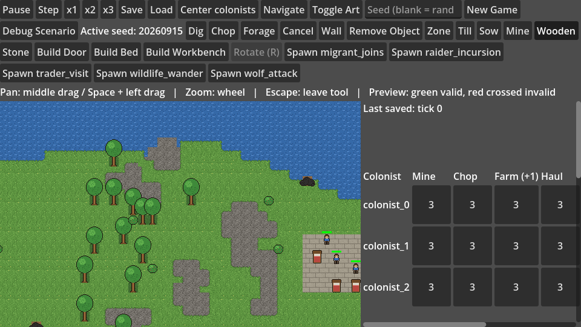
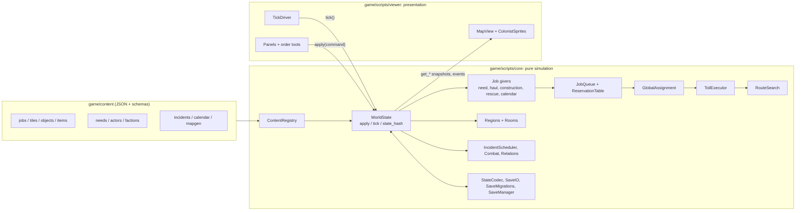

# Deepholm

## In plain words

Deepholm is a small colony-building game: a handful of settlers dig, chop wood, gather food, build walls and beds, and look after their hunger, thirst and sleep on a generated map. What makes it unusual is how it is built rather than how much content it has: the same starting map and the same player actions always produce exactly the same outcome, saved games keep loading after every change to the game, and hundreds of automatic checks run before any change is accepted. Most of the code was written and reviewed by AI coding assistants working under strict, written rules, with one person setting direction and checking the results. It shows that careful engineering habits make AI-assisted development trustworthy, and it can serve as a reference for anyone building testable simulations in the Godot engine.

**A deterministic, seeded colony simulation in Godot 4 — with the simulation fully separated from the viewer, versioned saves that still load 24 schema versions later, and a headless test suite that gates every change.**

Deepholm is a top-down colony sim: dig, mine, chop and forage, build walls and furniture, haul to stockpiles, keep colonists fed, watered and rested, fend off wolves and trade with visitors — on a seeded map that replays identically from any save. It is developed by [Sterium AI](https://www.steriumai.dev/), a one-person studio, with most of the code written and cross-reviewed by an AI agent pipeline (see [Built with an AI agent pipeline](#built-with-an-ai-agent-pipeline)).



<sub>The debug viewer with its generated placeholder art. Close-up: [docs/screenshots/map-closeup.png](docs/screenshots/map-closeup.png).</sub>

## At a glance

| | |
| --- | --- |
| Language / engine | 100 % GDScript, Godot 4.7 (GL Compatibility renderer, web export preset) |
| Simulation core | ~20.8k lines in `game/scripts/core/` — no scenes, nodes, rendering or wall-clock time |
| Viewer | ~3.9k lines in `game/scripts/viewer/` + `boot.gd` |
| Tests | **90** headless test scripts, **808** named check cases, ~**4,750** assertion call sites (~41k lines) |
| Saves | schema **v25**, **24** chained migrations, **14** frozen fixtures from older schemas |
| Content | **11** JSON content files, each with a JSON Schema |
| Decisions | **43** architecture decision records in `docs/decisions/` |

How these were measured is in [Numbers](#numbers). All documentation is indexed in [docs/README.md](docs/README.md).

## Design pillars

1. **Deterministic simulation, separated from the viewer.** The authoritative state lives in plain `RefCounted` GDScript. It advances only through `WorldState.tick()` and validated `WorldState.apply(command)` calls, draws randomness only from injected, seeded `RandomNumberGenerator`s, and exposes `state_hash()` so two runs can be compared exactly.
2. **Data-driven content with schemas.** Jobs (as toil lists), tiles, objects, items, needs, actors, factions, incidents, calendar and map generation are JSON records under `game/content/`, each with a schema in `game/content/schemas/`.
3. **Versioned saves with explicit migrations.** Saves are an integrity-hashed JSON envelope with a schema version; old saves are migrated step by step and validated before they replace anything.
4. **Headless tests as the gate.** Every simulation behaviour ships with a script that runs under `godot --headless` without loading a scene; CI runs the whole suite.

## What is in the simulation today

Scope as implemented in `game/scripts/core/` and `game/content/`:

| System | Scope today |
| --- | --- |
| World generation | Seeded maps (default 256x256) with a winding edge-to-edge river, correlated tree groves, rock veins and outcrops, hazards, berry bushes and a bounded, deterministic spawn-clearing search |
| Orders | Dig (leaves a trench that can trap actors; rescue and escape jobs), mine, chop, forage, cancel, stockpile zones |
| Construction | Wooden/stone walls (single or batched lines), doors, beds, a rotatable 2x1 workbench; construction sites fetch materials from several sources and chain deposits |
| Hauling | Stockpile zones, reservations, a 4-unit multi-kind "hands" carrying model, tools that must be fetched for dig/mine/chop |
| Needs | Eat, drink, sleep with per-day decay; interrupt / suspend / resume of the current job |
| Farming | **Tilling and sowing.** Crop growth and harvest are on the roadmap |
| Scheduling | Fair global job assignment with aging, a per-colonist labour priority table, calendar urgency windows |
| Combat | Wolves: approach, melee resolution, flee, health; lingering incident actors |
| Incidents | Wildlife wander, wolf attack, trader visit with a one-for-one trade offer, migrant joins; a raider-incursion entry that currently spawns a hostile animal under the raiders faction |
| Factions | Faction table with relations that gate reservations and hostility |
| Calendar | Days and seasons from content, calendar alerts |
| Map structure | Incrementally maintained regions (connectivity) and rooms (door/wall-bounded areas) |
| Persistence | Manual save + 3 rotating autosaves, atomic writes, last-known-good fallback, migrations v1 → v25 |
| Viewer | Tile-map rendering with a two-layer shoreline, colonist glide + walk/idle/carry/build animations, order tools with valid/invalid previews, work-priority table, colonist panel, camera pan/zoom, flat-colour diagnostic mode |

## Running it

Requirements: [Godot 4.7.x](https://godotengine.org/download) (the project and CI use 4.7.2). Python 3 + Pillow only if you want to regenerate the art.

```bash
# 1. Build the import cache once (needed before anything else on a fresh clone)
godot --headless --path game --import

# 2. Play: open game/project.godot in the Godot editor and press F5, or
godot --path game

# 3. Headless boot check
godot --headless --path game --quit-after 1

# 4. Screenshot of the running viewer (needs a display; output dir must exist)
godot --path game --script res://scripts/tools/screenshot.gd -- /absolute/output/dir
```

In the viewer, **New Game** starts a fresh seeded world (paused — press **x1**), the toolbar holds the order tools (Dig, Chop, Forage, Wall, Zone, Till, Sow, Mine, Build …), middle-drag or Space+drag pans, the wheel zooms, and **Toggle Art** switches to the flat-colour diagnostic renderer. **Debug Scenario** loads a small fixture world with furniture and queued orders. The incident buttons (**Wolf attack**, **Trader visit**, **Migrant arrives**, …) trigger a content incident immediately, for testing.

## Running the tests

```bash
# Full suite (bash: Linux, macOS, Git Bash on Windows)
tools/run_tests.sh /path/to/godot          # or: GODOT=/path/to/godot tools/run_tests.sh

# Full suite (PowerShell)
pwsh game/scripts/tests/run_all_tests.ps1 -GodotPath /path/to/godot

# One test
godot --headless --path game --script res://scripts/tests/test_world_state_determinism.gd

# Static lint: no tile ids / tick costs hard-coded in the core outside the content registry
pwsh game/scripts/tests/lint_content_literals.ps1
```

A test passes when its process exits 0 **and** prints `<test_name>: PASS`; the runners check both. A few viewer tests accept `-- --capture` when run with a real display (no `--headless`) and then write screenshots to `user://captures`.

CI ([`.github/workflows/ci.yml`](.github/workflows/ci.yml)) runs on Ubuntu 24.04 with Godot 4.7.2: JSON validation, the content-literal lint, the core size-budget check, import, the boot check and the **full** headless suite.

## Architecture



- `game/scripts/core/` — simulation. `world_state.gd` holds state, validates commands and records events; behaviour lives in the job engine (`jobs/`, `scheduling/`), job givers (`jobs/givers/`, `combat/`), routing, map analysis, incidents, persistence and world generation.
- `game/scripts/viewer/` + `game/scripts/boot.gd` — the Godot scene side: tick pacing, rendering, input, panels. It never mutates simulation state except through `apply()` and `tick()` (enforced by `test_architecture_rules.gd`).
- `game/content/` and `game/content/schemas/` — the rules as data. `game/data/` holds the viewer's text table, tile set and sprite frames, plus early schema sketches (`examples/`, `schemas/`) that the game does not load.
- `docs/architecture/` — contracts (game-state schema, save system, orders and movement, colonist AI, simulation boundaries, extension points) indexed by `source-of-truth.yaml`; `docs/decisions/` — ADRs; [`docs/README.md`](docs/README.md) — an index of all documentation, with a one-line summary per page; `docs/architecture/core-budgets.json` — line caps for the largest core files.

## Under the hood

### 1. Simulation core vs. viewer

**What.** Everything that decides what happens — terrain, colonists, jobs, items, incidents — lives in `game/scripts/core/` as `RefCounted` classes. The viewer (`scripts/viewer/`, `boot.gd`) renders and collects input.

**How.** `WorldState` exposes exactly two mutators: `apply(command) -> Dictionary`, which validates a typed command (`dig`, `build`, `place_zone`, …) and returns either an accepted result or a typed rejection, and `tick()`, which advances one simulation step (need, haul, construction and rescue givers, combat, then `GlobalAssignment` and the `ToilExecutor`). The viewer reads `get_*` snapshots and `get_events()`. `TickDriver` converts real time into ticks (paused / x1 / x2 / x3), and `ColonistSprites` interpolates the glide between tiles purely in presentation state. `test_architecture_rules.gd` scans every viewer script and fails if it calls anything on `WorldState` beyond getters, `apply()`, `get_events()` and `tick()`; `test_viewer_hash.gd` and `test_tile_variant_stability.gd` assert that the state hash is identical with art on or off.

**Why.** Rendering code that "helpfully" nudges state is a classic source of simulation drift: behaviour that depends on frame rate, window size or which renderer is active. With the boundary enforced, the whole simulation runs — and is tested — with no scene tree at all.

### 2. Seeded RNG injection and `state_hash()` determinism

**What.** Given the same seed and the same command stream, two runs produce identical states, tick for tick, including across a save/load round trip.

**How.** `WorldState._init(seed, …)` creates its own `RandomNumberGenerator` instances (a main stream, a dedicated dig-find stream, and the incident scheduler's own) and injects them into the modules that need randomness; core code never touches the global `randi()`/`randf()`. World generation uses separate geography and placement streams, so tuning one pass cannot shift another. Event ordering is stable (sorted ids, submission order) and authoritative values are integers. `state_hash()` builds a canonical snapshot — tiles, items, tools and their reservations, objects, zones, colonists, jobs, scheduler state, construction sites, suspended work and the incident RNG seed/state — and hashes its JSON. Saves store RNG `seed` and `state` as exact 64-bit integers; because `JSON.parse_string` returns floats, `SaveIO._restore_exact_rng()` rescans the raw text to recover them bit-exactly. `test_world_state_determinism.gd`, `test_save_reproducibility.gd` and others compare hashes across independent runs and across save → load → continue.

**Why.** Non-determinism turns "it happened once" into an unreproducible bug, breaks replays and rules out lockstep networking. A hash comparison makes a desync show up at the first differing tick rather than hundreds of ticks later.

### 3. The job engine: givers, queue, assignment, toils

**What.** There is one work engine. Everything a colonist does — dig, haul, eat, sleep, rescue, fight, build — is a job made of toils.

**How.** A job kind is data in `content/jobs.json`: `{kind, labour, toils: [go_to, work, pick_up, place, …]}`. *Job givers* (`jobs/givers/need_giver.gd`, `haul_giver.gd`, `construction_giver.gd`, `rescue_giver.gd`, `calendar_alert_giver.gd`, plus `combat/approach_giver.gd` and `combat_giver.gd`) decide **when** a job should exist and submit it. `jobs/job_queue.gd` owns the job lifecycle and explicit blocking reasons (e.g. `wait_for_item_release`), and reserves targets, items and cells through the shared `ReservationTable`. `scheduling/global_assignment.gd` matches workers to jobs fairly: priority, the colonist's labour table, measured route cost and an aging term so nothing starves. `jobs/toil_executor.gd` executes the fixed toil vocabulary, including bounded re-routing when a path gets blocked. Needs can interrupt a job, suspend its work progress and resume it later. `test_architecture_rules.gd` drives every job kind to completion through `tick()`, checks the executor's own trace, and fails if a second per-colonist state machine appears in `world_state.gd`.

**Why.** Colony sims tend to grow one bespoke state machine per activity, and those machines fight over the same colonist and the same items — double-booked resources, colonists stuck between two plans. One engine with explicit reservations turns those into testable invariants (`jobs/reservation_invariants.gd`).

### 4. Pathfinding, regions and rooms

**What.** Routes over a passability/cost field, plus cheap connectivity queries.

**How.** `routing/route_search.gd` is a budgeted uniform-cost search: each `resume()` expands at most `STEP_BUDGET` (64) frontier nodes and continues where it stopped, so a long search is spread across ticks instead of stalling one, and its bounded search space lets it prove a target unreachable. Tile costs come from `WorldState.passability()`, the single source of truth for what blocks movement. `map/regions.gd` labels connected walkable areas and updates them incrementally in `on_passability_changed(x, y)` — splitting or merging only locally, never re-flooding the whole map — and `map/rooms.gd` derives door- and wall-bounded rooms the same way.

**Why.** Unbounded pathfinding on a 256x256 map is a frame-time spike waiting to happen, and "is this reachable at all?" should not require a full search. Region ids answer it with a lookup, and per-tick budgets keep tick cost predictable.

### 5. Persistence: atomic writes, last-known-good, versioned migrations

**What.** Crash-safe saves that detect corruption, never destroy the previous good save, and keep loading saves from every older schema.

**How.** `persistence/state_codec.gd` encodes `WorldState` into a plain dictionary at `SCHEMA_VERSION` 25 and decodes it back, resuming in-flight searches. `persistence/save_io.gd` `write_atomic()` validates the state, wraps it in `{format, integrity: sha256, state}`, writes `<file>.tmp`, flushes, reads the temporary file back and verifies it, and only then renames it over the target. `read()` checks the envelope, the SHA-256 integrity hash and a deep structural validation (`_validate_state()`), and returns typed codes (`integrity_mismatch`, `save_from_newer_version`, `no_migration_available`, `schema_error`, …). `persistence/save_manager.gd` keeps one manual slot and three rotating autosaves ordered by (epoch, tick); `load_best()` falls back through them newest-first, and a last-known-good pointer only ever advances to a validated save. `persistence/save_migrations.gd` chains single-step migrations (`_migrate_v1_to_v2` … `_migrate_v24_to_v25`); each step first checks that its input really has the shape of that version (`_is_schema_vN_state`) and returns a new dictionary instead of mutating the input. `test_save_migration.gd` (~3.1k lines) loads 14 frozen fixtures (`tests/fixtures/save_schema_v1…v20_fixture.json`) through the full chain; `test_save_io_atomicity.gd` truncates files, flips bytes and simulates a crash between write and rename.

**Why.** It prevents three bug classes: a crash mid-write leaving a half-written save (temp file + verify + rename), silent corruption that loads garbage (integrity hash + validation), and old saves that stop loading after a data-model change (chained, fixture-tested migrations).

### 6. Data-driven content and schemas

**What.** Game rules that can be data are data: tick costs, job toil lists, tile passability and costs, object footprints, items, need decay, actor components, faction relations, incident weights, calendar and map-generation parameters.

**How.** `content/content_registry.gd` loads `content/*.json`, cross-reference-checks it at construction and is injected into the core. Every file has a JSON Schema in `content/schemas/`. `lint_content_literals.ps1` fails the build if a tile id or a work/move tick table is hard-coded in core code outside the registry.

**Why.** Balancing and content changes should not require touching engine code, and duplicated constants drift apart; the lint makes "one source of truth" mechanical rather than a convention.

### 7. The headless test harness

**What.** 90 test scripts, each a `SceneTree` script run with `godot --headless --script`; no external test framework.

**How.** Each script builds its own worlds (a small fixture map or a real seeded 256x256 world), drives them only through `apply()`/`tick()` or through the real viewer's button handlers, records failures via `_expect()`, and ends with `quit(1)` or prints `<name>: PASS`. `tools/run_tests.sh` and `run_all_tests.ps1` discover every `test_*.gd` and require both the exit code and the PASS marker, so a script that dies before its last line cannot pass by accident. The suite covers simulation behaviour, save compatibility, determinism, performance budgets (save time, incremental map refresh), architecture rules and viewer flows through the real `boot.tscn`.

**Why.** In a deterministic sim nearly every regression is reproducible from a seed and a few commands, so a cheap headless script catches it — and it gives any reviewer, human or AI, an objective gate.

## Why it's useful

- A **reference architecture for testable simulations in Godot**: game logic kept out of the scene tree, injected randomness, state hashing and headless tests that need nothing but the engine binary.
- A worked example of **save-format evolution**: 24 real migrations with fixtures, atomic writes and fallback slots — the part many projects add last.
- A **case study in AI-agent software development** with explicit contracts, ADRs, size budgets and cross-review, where the repository documents what the process produced.

## Curiosities

- The save schema went from v1 to v25, and each of the 24 steps has its own migration and its own version-shape check. Steps v2 → v25 were added in about eight days of development (2026-09-17 → 2026-09-25), because an agent adding a feature had to ship its migration and keep every frozen fixture loading in the same change, so no older save format was left behind.
- `world_state.gd` is capped by `docs/architecture/core-budgets.json` (5,030 lines; 4,994 at release, checked in CI). Raising a cap requires an ADR, which is why 14 ADR filenames end in `budget-increase`.
- All art is generated by one Python script (`tools/generate_placeholder_art.py`), and even the shoreline cells are tested from their pixels: `test_tile_atlas_map.gd` measures each grass cell's alpha to confirm its transparent side faces the direction the code claims.

## How it compares

In general terms, against public Godot projects and colony-sim prototypes (no specific repository implied):

- Many prototypes save with `ResourceSaver` or ad-hoc JSON without a schema version, so old saves break when the data model changes. Deepholm treats the save format as a versioned, validated contract with migrations and fixtures.
- Many game projects have little or no automated testing, and what exists often needs a running scene. Here most logic is tested headlessly and CI runs the full suite.
- Deepholm is **not** a finished game. Content breadth, art and UX are those of a vertical slice; the effort went into foundations — determinism, persistence, the job engine — rather than content volume or polish.

## Numbers

Measured on the released tree:

| Number | How it was measured |
| --- | --- |
| 90 test scripts | `ls game/scripts/tests/test_*.gd \| wc -l` |
| 808 check cases | named case functions: `grep -hE '^func _check_' game/scripts/tests/test_*.gd \| wc -l` |
| ~4,750 assertion call sites | occurrences of `_expect(` minus the 85 helper definitions |
| 24 migrations / schema v25 | `grep -cE '^static func _migrate_v[0-9]+_to_v[0-9]+' game/scripts/core/persistence/save_migrations.gd`; `SCHEMA_VERSION` in `state_codec.gd` |
| 14 save fixtures | `ls game/scripts/tests/fixtures \| wc -l` |
| 43 ADRs | `ls docs/decisions/*.md \| wc -l` (numbered 001–043, one number per decision) |
| Line counts | `wc -l` over `game/scripts/core/**/*.gd`, `game/scripts/viewer/*.gd` + `boot.gd`, and `game/scripts/tests/*.gd` |

## Built with an AI agent pipeline

Deepholm was built largely by AI coding agents — Claude Code, OpenAI Codex and GitHub Copilot — orchestrated by [sterium-ai/agent-orchestrator](https://github.com/sterium-ai/agent-orchestrator). A human sets objectives, playtests and integrates; agents write contracts, code and tests, and a *different* agent reviews each change against its contract and the headless test results before it merges. The rules the agents follow are in [AGENTS.md](AGENTS.md): simulation-purity rules, one owner per subsystem, contracts and ADRs before boundary changes, core size budgets, and tests as the review gate. Many constraints visible in the code (size budgets, architecture tests, content lints, typed rejections) exist precisely so an automated reviewer can check them.

## Roadmap

- Crop growth and harvest (farming currently stops at tilling and sowing)
- Workbench recipes (`game/data/examples/recipes.json` sketches the shape)
- Dedicated actor art for wolves and traders; real pixel art to replace the placeholders
- Exposing completed-object orientation to the viewer (vertical workbench)
- Human raiders and richer trade than one-for-one offers
- Splitting `world_state.gd` further along the existing extension points

## Licence and credits

Code and generated art: MIT — see [LICENSE](LICENSE). © 2026 Sterium AI.
Assets: [game/assets/CREDITS.md](game/assets/CREDITS.md) — every image is original placeholder art generated by `tools/generate_placeholder_art.py`; no external assets are included.

Contact: hello@steriumai.dev
